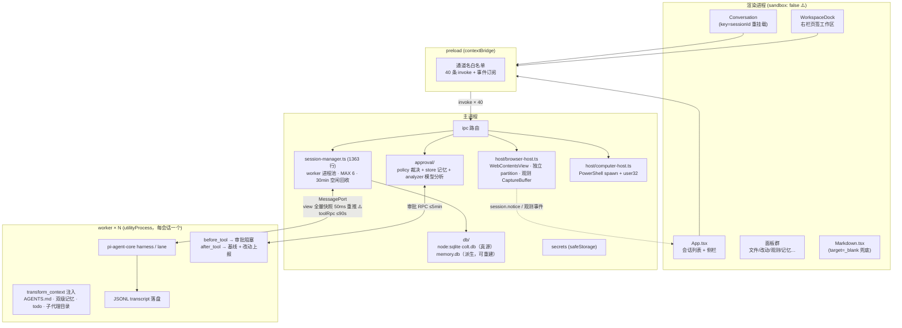
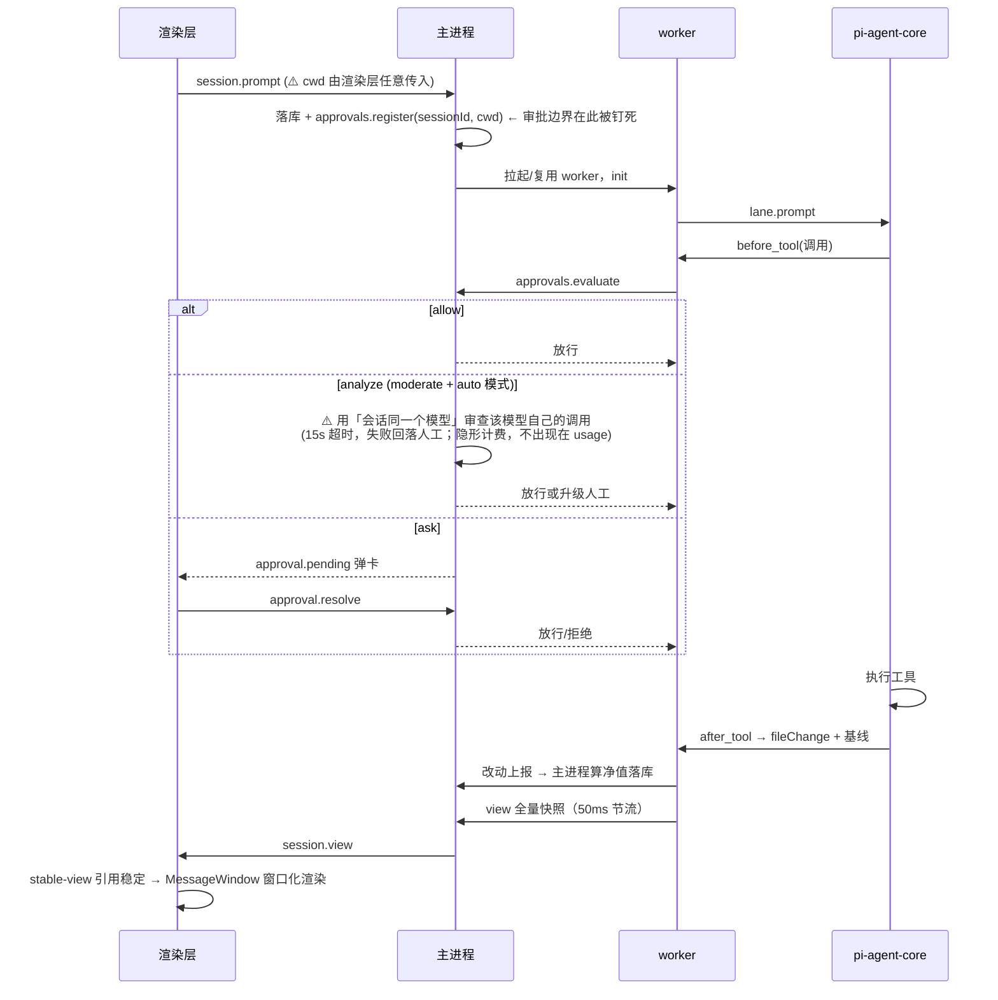

# Colt 架构与特性批判性审查

> 审查日期：2026-09-19
> 审查方式：**读代码为主，读文档为辅**。所有判断以仓库现状为准，文档只作为「设计意图」的参照物，不作为事实依据。
> 审查范围：四进程架构、会话/worker 生命周期、审批系统、模型解析、视图与性能、浏览器宿主、电脑控制、记忆/技能/子代理、输入区与斜杠命令、UI 一致性。

---

## 0. 验证基线（本次实跑，非引用文档）

在给出任何批判之前，先固定事实：

- **TypeScript 三份配置全绿**：`tsconfig.node.json` / `tsconfig.web.json` / `tsconfig.test.json` 均 `tsc --noEmit` 通过。
- **单测 981 条全绿**（`node --import ./tests/ts-resolve.mjs --test "tests/**/*.test.ts"`，pass 981 / fail 0）。
- IPC 通道 **40 条**（`src/shared/protocol.ts:235` 的 `IPC_CHANNELS` 实测计数），事件通道另有独立白名单，两侧由编译期 `MustBeNever` 双向断言锁死（`protocol.ts:869-870`）。
- 内核依赖 `@earendil-works/pi-agent-core` 与 `pi-ai` 均 **pin 0.85.1**，Electron pin 44.2.0，依赖面收敛。
- 库内实测存在 **2937 条消息**的会话——这不是玩具项目，性能讨论必须按真实数据规模谈。

结论先行：**这是一份健康的代码库，本报告不指控它「编译不过、测试红、到处是 bug」。火力集中在三个层面——安全边界的自相矛盾、承诺与实效的落差、以及被文档吸收而未被结构消除的复杂度。**

发现按严重度分为三档：**P0 = 安全/诚实性问题，应尽快修**；**P1 = 设计缺陷或明显体验欠账**；**P2 = 小 bug 风险与值得公开质疑的产品判断**。

---

## 1. 架构图

### 1.1 进程视图

### 1.2 一次对话的时序

### 1.3 架构总评

**做对了的部分（要明说，否则批判不公允）：**

1. **契约单一真源 + 编译期双向断言**是这套系统最强的实践。40 条通道的增删任何一侧漏改都会编译失败，`contract.test` 再兜一层运行时。IPC 面在这个体量下保持可控，靠的就是这个闸。
2. **四进程隔离的方向是对的**：渲染层不持密钥（safeStorage 在主进程）、worker 可独立回收、浏览器宿主用独立 partition。每条隔离都对应一个真实的威胁模型。
3. **fail-closed 的默认值**贯彻得好：审批分析器任何异常都回落人工而非放行；`isAnalyzeEligible` 的结构白名单意味着「模型只能否决、不能授予」；未知斜杠命令一律放行而不是吞掉（判错方向代价不对称的自觉，少见）。
4. **验证文化罕见**：981 条单测 + 多模式冒烟（dock / ask-user / ask-user-e2e / model…）且冒烟用例吃过「假红」的亏后形成了「先怀疑测试接入」的纪律。

**但架构层面有两笔最大的债，本报告的核心主张都挂在这两条上：**

1. **安全边界在「渲染层不可信」这个前提上自相矛盾**（见 F1/F3/F6）——同一份 SECURITY.md 把渲染层列为不信任来源，却在会话链路上让渲染层指定审批边界的锚点。
2. **复杂度被文档吸收，而非被结构消除**。AGENTS.md 是一份罕见诚实的事故档案（这是优点），但 13 条「冒烟踩坑」、5 次「凭截图推测」的重复事故，说明系统的正确性过度依赖「操作者读过文档」这一不可强制的前提。文档写得越好，越容易掩盖「这个设计为什么需要这么多警告」的追问。

---

## 2. P0 发现

### F1 · 审批的项目根由不可信方指定（安全边界自相矛盾）

**证据链：**

- `file.read` 的设计是**不信任渲染层**的典范：主进程按 `sessionId → project → root_path` 自己推导根目录，三层校验（`main/ipc/index.ts` 的 handler + `main/file-read.ts`），渲染层只传 sessionId 和路径。
- 但 `session.open` / `session.prompt` 的 `cwd` 由**渲染层任意传入**，IPC handler 原样转发给 `sessionManager.ensureWorker({cwd})`。
- 而 `session-manager.ts:716`：`this.approvals.register(options.sessionId, options.cwd)` ——**这个渲染层给的目录，被登记成了审批系统的项目根**。

于是：「写项目内文件 = moderate、项目外 = 高危」这条审批边界，其「项目内」的定义权在被 SECURITY.md 明确列为不信任来源的那一方手里。一个能控制渲染层的注入内容（Colt 会渲染 agent 生成的 Markdown），理论上有机会把任意目录说成是「项目根」，把高危写操作降级成 moderate，再走自动审批。

**这为什么是 P0 而不是 P1**：它不是「理论上可能存在」的漏洞类别，而是**同一仓库内两套信任假设的直接冲突**——`file.read` 已经证明了「主进程按 sessionId 反查项目根」这条路是通的、且团队认可这个模式，`session.open` 只是没跟上。

**修法**（改动很小）：`session.open`/`session.prompt` 的 `cwd` 也由主进程按 sessionId 反查项目根推导，渲染层传的 `cwd` 字段从契约中删除或降级为「仅新建会话时的一次性输入、入库后以库为准」。

---

### F2 · 自动审批分析器：同模型自审 + 隐形计费（诚实性问题）

**证据链：**

- 自动审批分析器（`main/approval/analyzer.ts`）用**会话同一个 provider + model**（`session-manager.ts` `#analyzeThenReply`，取 `entry.provider`/`entry.modelId`）审查该模型自己生成的工具调用。
- 调用方式是 pi-ai `models.complete` **直调，不经内核 harness**——因此**不产生 usage 事件，不出现在会话统计里**。

两个问题叠加：

1. **安全增量存疑**。让一个模型审查它自己刚生成的调用，对提示注入几乎没有对抗增量——注入者控制了生成侧，就大概率也能影响审查侧。真正的防线是 `isAnalyzeEligible` 的结构白名单（「模型只能否决、不能授予」），这一点文档承认。但产品文案「普通操作由大模型判定」给用户的安全预期，**高于**这个机制实际能提供的安全水平。
2. **计费不透明**。auto 模式下每次 moderate 操作都伴随一次模型调用，用户付了这个钱，却在任何统计界面看不到它。这与项目自己为 memory-tidy 定下的原则——「费用藏起来是静默」——**直接矛盾**。自己立的规矩，自己破了。

**修法**：分析器调用计入 usage（哪怕单列一类「审批分析」）；产品文案降级为「结构白名单为主、模型复核为辅」；长期应考虑「审批模型 ≠ 会话模型」的配置项。

---

### F3 · 安全告知 5 秒消失、不留痕

**证据链：**

- worker 的所有 notice——技能装载告警、同名技能覆盖、AGENTS.md 读取失败、记忆索引失败——全是 SECURITY.md 承诺「如实告知」的安全相关事件。
- 它们都走 `session.notice` → 渲染层 `setCompactNotice` → `Conversation/index.tsx:574-576`：`setTimeout(() => setCompactNotice(null), 5000)`。**5 秒后消失，无历史、无 badge、无任何方式回查。**

「技能装载失败」和「同名技能被覆盖」是用户**必须知道**的安全信号（后者意味着可能有技能投毒），却和「已压缩上下文」这种瞬时操作反馈混在同一个通道、同一个生命周期。

「如实告知」被做成了「一闪而过」。**承诺与实效的落差，比不承诺更糟**——用户以为出了事自己会知道，实际上不知道。

**修法**：notice 分级。安全类 notice 进持久化的事件流（改动页签或独立「事件」视图），瞬时反馈继续用 toast。通道已经存在，缺的只是分流。

---

## 3. P1 发现

### F4 · 侧栏把「提问」和「审批」合并成「等待你的授权」（UI 一致性）

协议层**刻意**把审批与提问分成两条通道——`approval.pending` / `userquestion.pending`，worker-protocol 里注释强调两者语义不同。但 `App.tsx:103` 把它们合并成 `pendingSessions`，`App.tsx:940` 文案统一显示「**等待你的授权**」。

模型向你**提问**（「要部署到生产还是预发？」）不是向你**申请授权**。协议层的语义区分在 UI 层被抹平了，而且抹的方式是**用错词**——授权是一个安全动作，提问是一个协作动作，混用会稀释用户对真正授权卡的警觉（授权疲劳的前奏）。

**修法**：侧栏 badge 区分两种状态，文案分开（「等待回答」/「等待授权」）。

### F5 · 右栏宽度切会话即丢（体验欠账）

`dockWidthUser` 存在 Conversation 组件 state（`Conversation/index.tsx:227`），而 Conversation 以 `key={sessionId}` 重挂载——**切一次会话，用户拖的宽度就没了**，重启更丢。

讽刺的是，宽度的语义在 v1.24 已被定调为「全局统一值 544，不随页签变」——既然是全局语义，存在会话级 state 里就是放错了地方。持久化到 localStorage 是零成本的事。

### F6 · 渲染进程纵深防御缺口（安全）

- 主窗口 `webPreferences: { sandbox: false }`（`main/index.ts:49`）——electron-vite ESM preload 的代价，可以理解，但它意味着渲染层一旦被注入，没有沙箱兜底。
- **无 `will-navigate` 拦截**（全仓库仅两处 `setWindowOpenHandler`：`main/index.ts:94` 和 `browser-host.ts:680`）。目前 `Markdown.tsx:78` 的 `<a target="_blank" rel="noreferrer">` 兜住了链接路径（走 setWindowOpenHandler → shell.openExternal），但任何**同窗口导航**路径（window.location、meta refresh、未来的新渲染入口）没有第二道防线。
- preload 白名单是**通道名粒度**：`secrets.set`、`session.delete`、`approval.rules.clear` 与只读通道对渲染层同等暴露。结合 F1，渲染层的破坏面比「一个展示层」该有的样子大得多。

**修法**：加 `will-navigate` 拦截（非 allowlist 一律拒绝）；破坏性通道在 preload 侧做二次封装（如 `session.delete` 要求主进程弹确认——主进程已有 `dialog.confirm` 通道）。

### F7 · 视图传输：ConversationView 全量快照 50ms 重推（架构级性能债）

`worker/entry.ts:270-285`：`pushView` 每次发送**整份** `project(state.snapshot, …)`，50ms 节流。流式期间，整份 transcript 每 50ms 在 worker→main（结构化克隆）和 main→renderer（`webContents.send`）两段各复制一次。库内实测有 **2937 条消息**的会话——这个成本随历史线性增长，且在用户感知最强的流式期间持续发生。

团队优化了**渲染层**（stable-view 引用稳定 + MessageWindow 窗口化，这些是对的），但没有解**传输层**。图片外置（tool-image-spill）只解决了截图这一种大 payload。

**修法**（按投入排序）：① 增量协议（append + 尾部 patch）——工作量大；② 视图分页，transcript 尾部窗口化传输；③ 至少把「无变化不重推」做到位（当前 50ms 节流在思考静默期也在推同一份内容——需确认，如果已做内容哈希则此项作废）。

### F8 · auto 审批的隐性延迟没有解释（体验）

每次 moderate 操作在 auto 模式下叠加一次模型往返（15s 超时上限），失败回落人工。用户体感是「有时弹卡有时不弹、有时卡几秒」，而界面**没有任何地方解释这个代价从哪来**。审批卡的等待态不区分「在等模型分析」和「在等你点」。

这不是 bug，是一个被隐藏的产品成本。要么在审批卡上显示「正在自动分析…」，要么重新评估 auto 模式的默认值。

---

## 4. P2 发现

### F9 · `#analyzeThenReply` 无 `void`/`.catch`，审计只进 stdout

`session-manager.ts:846` 调用 `this.#analyzeThenReply(...)` 无 `void` 标注、无 `.catch`。`analyzeToolCall` 内部全 catch（fail-closed 做得对），但其后的 `commitAnalyzed`/`postMessage` 若抛错即成 unhandledRejection。且审批「审计留痕」只 `console.log` 到 stdout——**打包后的应用没有终端，等于没有审计落盘**。安全功能的审计痕迹在真实分发形态下不存在。

### F10 · computer_action 每个动作 spawn 一个 powershell.exe

每个桌面动作 100–300ms 冷启动，桌面自动化链路（截图→操作→再截图的闭环）被这个延迟成倍放大。这是「避免原生模块」的刻意取舍，方向可以理解，但值得点名：**当一个特性 slow by design，产品文案应该管理预期**，否则用户会把架构取舍当成 bug 报告。

### F11 · 常驻定时器堆叠

App 1s 心跳 + Conversation 1s + 原生视图 400ms 重申 + 观测抽屉 1s 轮询。原则 #9 的省流开关未实现（文档承认）。单独看每个都有理由，合起来是一个「永不停歇」的应用。400ms 重申是为「电平状态不能只靠边沿同步」交的学费（AGENTS.md ⑤），合理，但应该在窗口失焦/最小化时降级。

### F12 · 设计质疑：子代理只有 fresh 隔离，不继承主对话上下文

`worker/lib/subagent.ts`：depth=1 禁递归、MAX_CONCURRENT=3、单路 10 分钟墙钟——这些闸都对。但「不继承上下文」意味着**最自然的委派诉求做不了**：「接着我手头这事，把这个子问题查完」。文档给了理由（显式有损交接迫使主代理提炼任务），这个理由站得住一半——它防住了上下文污染，也防住了最值钱的用法。值得作为产品判断公开质疑，而不是当作已定结论。

### F13 · 设计质疑：审批记忆不落盘 × worker 30 分钟回收 = 反复重新授权

「本次会话记住」的审批记忆随 worker 回收消失。用户离开 30 分钟回来，之前授过的权全部重新弹。文档（§九4）承认了一半。这两个各自合理的设计，组合出一个持续骚扰用户的体验——**组合效应没有人为它负责**。

---

## 5. 已知欠账（文档已承认，列出以示公允，不重复批判）

原则 #5 授权卡无「取消」态；#9 省流开关未实现；#6 已废弃；`lastResult` 随 worker 回收丢失 → 失败会话重开后显示「空闲」（状态会撒谎）；下载数量无真上限（5 只是观测缓冲）；browser 多实例未做；重型视图挂起未实现；`session-manager.ts` 1363 行靠体量闸（RATCHET，上限=建闸日实测，零余量）硬压；标题栏放产品功能违反区域 ①；`--w-sidebar` 死令牌。

这些文档认账认得干脆，是项目成熟的标志。但认账不是销账——「已废弃的原则」还躺在原则清单里，本身就是文档信誉的缓慢腐蚀。

---

## 6. 发现汇总

| # | 档 | 一句话 | 证据 | 修法概要 |
|---|---|---|---|---|
| F1 | P0 | 审批项目根由渲染层指定 | session-manager.ts:716 vs file-read.ts 的对比 | cwd 改由主进程按 sessionId 反查 |
| F2 | P0 | 同模型自审 + 审批调用不计费 | approval/analyzer.ts + session-manager.ts `#analyzeThenReply` | 计入 usage；文案降级；审批模型可配 |
| F3 | P0 | 安全 notice 5 秒消失不留痕 | Conversation/index.tsx:574-576 | notice 分级，安全类进持久事件流 |
| F4 | P1 | 提问被显示为「等待你的授权」 | App.tsx:103, :940 | badge 与文案分开 |
| F5 | P1 | 右栏宽度切会话即丢 | Conversation/index.tsx:227, :414 | 提升到全局 state + localStorage |
| F6 | P1 | sandbox:false + 无 will-navigate + preload 通道名粒度 | main/index.ts:49, :94 | 加导航拦截；破坏性通道二次确认 |
| F7 | P1 | 视图全量 50ms 重推 | worker/entry.ts:270-285 | 增量协议或尾部窗口化 |
| F8 | P1 | auto 审批延迟无解释 | ANALYZE_TIMEOUT_MS=15s | 审批卡显示「正在自动分析」 |
| F9 | P2 | 无 catch + 审计不进盘 | session-manager.ts:846 | void+catch；审计落 colt.db |
| F10 | P2 | 每动作 spawn PowerShell | host/computer-host.ts | 常驻 PowerShell 进程或文案管理预期 |
| F11 | P2 | 定时器堆叠 | App/Conversation/browser-host | 失焦降级 |
| F12 | P2 | 子代理不继承上下文 | worker/lib/subagent.ts | 公开讨论「带摘要委派」模式 |
| F13 | P2 | 记忆不落盘×30min 回收=反复授权 | approval/store + session-manager | 审批记忆可选落盘（按项目） |

---

## 7. 总评

这份代码库的工程纪律在开源项目里属于上游：契约真源、fail-closed、编译期断言、事故驱动的 AGENTS.md。批判它不是因为它差，而是因为它**好到值得用更高的标准量**。

三条主线收束成一个判断：

1. **安全模型在纸面上是自洽的，在代码里是分裂的。** `file.read` 证明团队知道怎么不信任渲染层，F1 证明这个认识没有贯穿到会话链路。这不是能力问题，是一致性问题——而一致性恰恰是安全边界唯一重要的属性。
2. **「如实告知」的文化停留在了「产生信息」，没有走到「保证送达」。** F2 的隐形计费、F3 的 5 秒 notice、F9 的 stdout 审计，是同一个缺陷的三个化身：信息被生产出来了，然后在到达用户之前消失了。一个以「诚实」为设计原则的产品，需要审计自己的每一条告知通道的**到达率**。
3. **文档在替结构还债。** AGENTS.md 的 13 条踩坑记录，一半是「这个设计需要人小心」的另一种说法。好的文档降低认知成本，但当文档成为正确性的**前提**，它就是技术债的记账本。F4/F5/F7 都不是文档能解决的问题——它们需要的是把语义放回结构里（区分通道、放对 state 层级、传输与渲染同构）。

如果只做三件事：修 F1（半天工作量，堵上安全模型的裂缝）、给 notice 分级（F3，一天）、把审批分析计入 usage（F2，半天）。这三件都不难，难的是承认它们值得做——因为每一件都需要推翻一个「文档里已经说通了」的结论。
